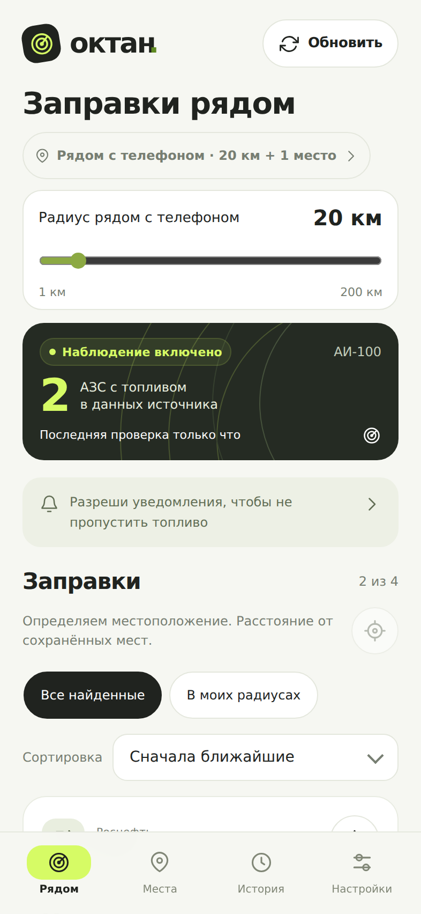
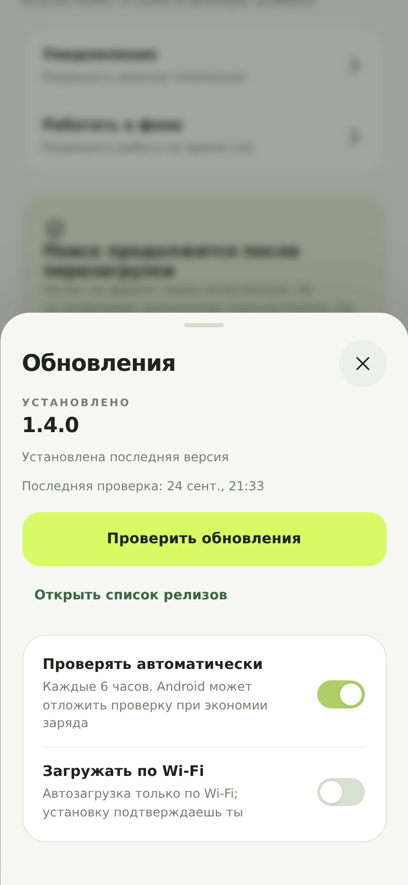

# Октан

**Октан** — бесплатное приложение для наблюдения за выбранными АЗС. Добавляйте места и станции, выбирайте топливо и сети, а Октан сам проверяет появление нужных записей и присылает уведомление об изменениях.

Автор: **Годованюк Кирилл Геннадьевич**.

➡️ **[Скачать последнюю версию](https://github.com/kirill31337/Oktan-Releases/releases/latest)** — страница релиза с APK и заметками о выпуске.

## Что умеет

- Радиус телефона и сохранённые места: показываем АЗС рядом и там, где вы бываете.
- Выбор топлива (АИ‑100, 98, 95, 92, ДТ, Газ, Метан) и сетей.
- Фоновая проверка по расписанию и уведомления только о важных изменениях.
- История наблюдений и локальные данные на телефоне.
- Темы: авто, светлая, тёмная.

## Интерфейс

  
  

На иллюстрации главного экрана — демонстрационные данные.

## Установка

1. Откройте [страницу последнего выпуска](https://github.com/kirill31337/Oktan-Releases/releases/latest).
2. Скачайте APK `Oktan-<версия>.apk` из раздела **Assets**.
3. Откройте файл и подтвердите установку. Android может попросить разрешение устанавливать приложения из этого источника.

Требуется **Android 8.0 и новее**.

## Обновления

- В приложении: **Настройки → Обновления**. Октан проверяет новые версии автоматически примерно раз в 6 часов.
- Скачивание обновления по Wi‑Fi можно включить по желанию, чтобы не расходовать мобильный трафик.
- Установка подтверждается системным диалогом Android — обновление не ставится без вашего согласия.
- **Первый переход с версии 1.3.x** выполняется вручную: скачайте APK со [страницы выпусков](https://github.com/kirill31337/Oktan-Releases/releases/latest) и установите поверх, как обычное обновление.
- Данные сохраняются: у приложения постоянный идентификатор `ru.kirill.oktan` и одна и та же подпись, поэтому места и история не теряются при обновлении.

## Источники данных

Октан — независимое приложение и не связан с сетями АЗС: названия сетей указывают только источник данных.

- Данные карт и списков могут **запаздывать** относительно реальной ситуации.
- Для Роснефти и Татнефти наличие топлива в списке означает, что оно доступно **по данным источника**. Пустой ответ или ошибка сети означают лишь отсутствие сведений — фактическое наличие не подтверждается.

## Бесплатно и по желанию

Приложение бесплатное: подписки и платного доступа к функциям нет. Добровольная поддержка автора не даёт дополнительных возможностей и ни к чему не обязывает.

## Документы

- [Политика конфиденциальности](docs/PRIVACY.md)
- [Условия использования](docs/TERMS.md)

Исходный код приложения закрыт.
